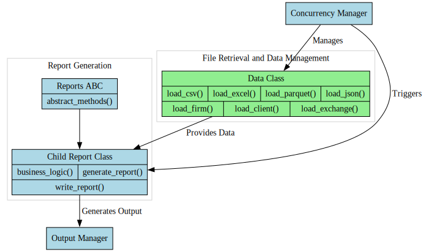

# High-Performance Report Generation

## Architecture Overview

### System Overview

Our application generates time-sensitive reports using a custom thread-safe library to load files into Pandas dataframes. The system processes dozens of files, some exceeding 1GB, to produce several reports, each requiring a subset of the loaded data. To optimize performance, we employ multithreaded batch loading and generate reports as soon as their required datasets are available.

### Object Model

The application's architecture is built around report classes. An abstract base class defines the overall structure, with child classes implementing specific business logic for each report type. Data loading is handled by a separate data class, which manages file retrieval and dataframe creation. Multiple report classes can be serviced by the same data class. We maintain a strict separation between data loading and business logic to adhere to our design patterns.

### Concurrency and Parallelism

Concurrency and parallelism are key features of our system. Files are loaded concurrently, with progress tracking to trigger report generation at the earliest opportunity. Report generation itself is multiprocessed to leverage our CPU-dense infrastructure for these computationally expensive, CPU-bound tasks.

### Design Decisions

Our design intentionally places report writing methods within the report classes rather than the data class. This decision stems from the need to handle client-identifying information, which we classify as business logic. Without this requirement, the data class would have been responsible for both reading and writing operations.

### System Performance

This architecture allows us to efficiently process large datasets and generate reports in near real-time, meeting the needs of users who rely on this output for time-critical decision-making.
